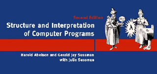

# SICP - 计算机程序的构造和解释

    

## 书籍介绍

- 介绍（评论中有很多值得参考的资料）
  - [Structure and Interpretation of Computer Programs - 2nd Edition (MIT)](https://book.douban.com/subject/1451622/)
  - [计算机程序的构造和解释](https://book.douban.com/subject/1148282/) 
- 下载链接（仅供参考，建议购买实体书）
  - ReadFree：<https://readfree.me/book/1148282/>
  - 百度网盘：<https://pan.baidu.com/s/1f7yuEfLq4uxiHzfq0uQwcQ> 提取码：0jcq 

## 视频课程（MIT）

- MIT 原版：<https://ocw.mit.edu/courses/electrical-engineering-and-computer-science/6-001-structure-and-interpretation-of-computer-programs-spring-2005/>
- 中文化项目及课程学习资料搜集：<https://github.com/DeathKing/Learning-SICP>

## 待续

- ……